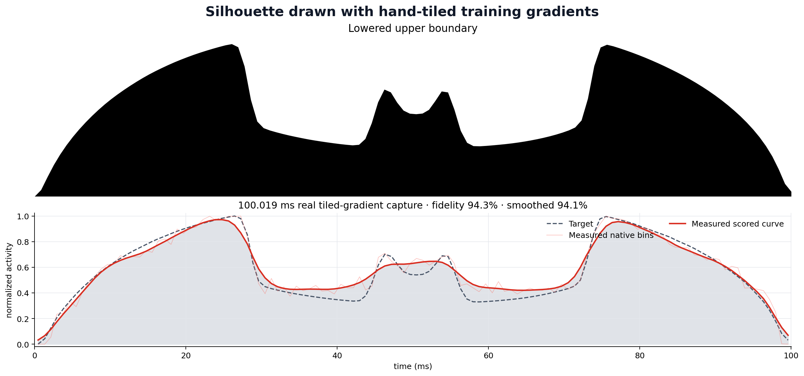
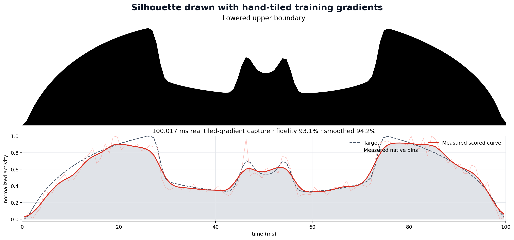

# Drawing with traces

Draw a PNG silhouette with the **measured power activity of real GPU model training**.

This is a standalone experiment built on [SideCapture](https://github.com/anpaure/sidecapture).
It uses a ChipWhisperer Husky Plus to capture an H100 PCIe while a hand-tiled training gradient changes
GEMM width over time. The plotted result is measured data: it is not synthesized, shifted, or warped.



## Best verified hardware result

| Property | Result |
|---|---:|
| Profile duration | **100.019 ms measured** |
| Distinct target positions | **120** (0.833 ms each) |
| ChipWhisperer capture | **1.5 MSPS burst**, 165,000 samples |
| GPU / model | H100 PCIe / 16,777,216 parameters |
| Multiscale fidelity | **94.26%** |
| Native-bin fidelity | **94.42%** |
| Smoothed fidelity | **94.09%** |
| Pearson correlation | **0.9790** |
| R² | **0.9441** |
| Train loss for promoted step | **0.40575 → 0.34279** |
| Held-out loss for promoted step | **0.93094 → 0.92316** |
| Gradient relative L2 error vs untiled | **7.41 × 10⁻⁷** |
| Drawing / ordinary training | **9.57 / 1764.56 steps/s** |

The complete 17 MB result is committed under
[`results/logo-100ms-120-active-lead`](results/logo-100ms-120-active-lead). It includes all raw
SideCapture records, annotations, tile commands, health reports, calibration, candidate plots, training
metrics, and a compact [`published_summary.json`](results/logo-100ms-120-active-lead/published_summary.json).
The promoted result is capture **5**, accepted on its first attempt with all 165,000 samples present,
no ADC clipping, no annotation bounds errors, and no health issues.

## 14-layer residual-MLP result

The repository now also contains a closer Fable-style workload: a genuine **14-layer, 234,881,024
parameter residual MLP** with a handwritten tiled forward/backward pass.



| Property | Residual-MLP result |
|---|---:|
| Multiscale / native / smoothed fidelity | **93.08% / 92.11% / 94.21%** |
| PyTorch autograd gradient error | **exactly zero** in BF16 |
| Tiled versus untiled gradient error | **exactly zero** |
| Train loss for promoted step | **0.07250 → 0.07174** |
| Held-out loss for promoted step | **0.08020 → 0.08000** |
| Drawing / ordinary training | **9.10 / 125.31 steps/s** (median) |
| Drawing slowdown | **13.77×**, versus 184.39× for the linear workload |

This is currently the strongest *real-model/training-efficiency* result, while the linear workload still
has the strongest absolute waveform score. The curated residual result includes the promoted physical
trace, annotations, commands, layer/column coverage, health record, plots, and independently recomputed
checksums under [`results/resmlp-v1-100ms-120`](results/resmlp-v1-100ms-120).

## One-command reproduction

```bash
python -m pip install -e .

draw-power-png assets/logo-top.png \
  --output runs/logo-100ms \
  --engine timed \
  --silhouette-mode upper-boundary \
  --points 120 \
  --duration-ms 100 \
  --capture-window-ms 110 \
  --sample-rate 1.5MHz \
  --batch-size 512 \
  --target-accuracy 95 \
  --max-refinements 8 \
  --replicates-per-refinement 3 \
  --ilc-gain 0.10 \
  --minimum-ilc-gain 0.0125
```

For the 14-layer residual MLP, add:

```bash
  --training-model residual-mlp \
  --residual-depth 14 \
  --residual-scale 0.125 \
  --residual-learning-rate 0.002 \
  --batch-size 256
```

This requires the installed H100/ChipWhisperer setup and SideCapture's hardware dependencies. Model and
scope setup happen once. Every accepted drawing capture applies another optimizer step to the same
persistent model.

## What actually runs

The original workload is a teacher–student linear model with the objective

```text
loss = 0.5 / batch × ||XW − Y||²
gradient = Xᵀ(XW − Y) / batch
```

Each controlled block computes a real forward tile `X @ W[:, start:end]` and its real weight-gradient
tile `X.T @ residual[:, start:end]`. Tile width changes Tensor Core occupancy and therefore measured
power activity. Visits to an output column are averaged before deferred SGD, so scheduling changes the
power waveform without changing the intended gradient. The result is numerically equivalent to the
untiled BF16 gradient to approximately `7.4e-7` relative L2 for the promoted step.

The residual engine trains

```text
h[l + 1] = h[l] + 0.125 × relu(h[l] W[l]),  l = 0…13
loss       = 0.5 / batch × ||h[14] − Y||²
```

It prepares the real reverse-mode delta for every layer, then schedules true blocks of
`h[l].T @ delta[l]` across the 100 ms profile. The scheduler traverses layers and output columns rather
than replaying a fake burner kernel. Repeated visits are averaged, missing blocks are completed after
capture, and the accepted update is compared with both an untiled handwritten gradient and PyTorch
autograd. Both comparisons were bit-for-bit exact in the verified H100 run.

### Why drawing is slower

An ordinary residual-MLP optimizer step takes about **8 ms** once warm. A 100 ms requested waveform has
an unavoidable ceiling near 10 drawing steps/s before setup, completion, and update overhead. To keep
all 120 levels physically present, the GPU also computes roughly 24 traversals' worth of gradient-column
work in the promoted step. This is useful gradient arithmetic, but repeated visits must be averaged to
preserve the same update. The resulting measured step is about 110 ms, or 13.77× slower than the same
model without drawing. The earlier linear model's ordinary step is only about 0.57 ms, which is why its
fixed 100 ms drawing window creates the much larger 184× ratio.

## Why the active baseline matters

Earlier versions mapped target zero to GPU idle. That allowed H100 SM clocks to collapse between low
bins and made the next power level depend on DVFS history. The verified path instead:

- maps the lowest target level to a real **128-column gradient tile**;
- runs that same narrow tile during the 2 ms lead period;
- sweeps 23 candidate widths from 128 through 4096 (the measured monotonic range retained 22 through
  3072);
- uses 120 **distinct target positions**, with no repeated target block inside the trace.

`--replicates-per-refinement 3` means three separate physical training captures are used to form robust
median feedback for one ILC round. It does **not** repeat or average blocks inside the promoted trace.
The published picture and score belong to one unaveraged capture.

## Measurement and score

The Husky input is AC-coupled, so this experiment reports normalized ChipWhisperer activity rather than
calibrated watts. Timed mode preselects RMS activity before seeing a drawing trace and uses target-free
2nd/98th-percentile normalization. No target-aware affine fitting is applied.

To prevent display smoothing from hiding bin-scale ripple, the primary fidelity combines native and
smoothed errors:

```text
multiscale_rmse = sqrt((raw_rmse² + smoothed_rmse²) / 2)
fidelity        = 100 × (1 − multiscale_rmse)
```

The faint red line in the plot is the native 120-bin measurement; the solid line is the sigma-2 scored
curve. Both metrics are stored. “Fidelity” here is a waveform score, not classification accuracy.

## SideCapture integrity

SideCapture owns acquisition and durability:

- plans, arms, and reads the Husky;
- maps CUDA/host annotations into ADC sample boundaries;
- validates length, finite values, variance, flatlines, clipping, and bounds;
- retries failed acquisitions and recovers the sampler;
- crash-safely commits raw channels, records, annotations, artifacts, and provenance.

The workload update is transactional. A rejected trace clears accumulated gradients; only an accepted
trace applies SGD. Post-profile gradient completion and active-lead arithmetic are included in the
reported FLOPs and drawing-vs-no-drawing timing.

## More documentation

- [Experiment and implementation guide](docs/EXPERIMENT.md)
- [Resolution and controller ablations](docs/RESULTS.md)
- [Compact published metrics](results/logo-100ms-120-active-lead/published_summary.json)
- [Residual-MLP compact metrics](results/resmlp-v1-100ms-120/published_summary.json)

## Earlier modes

The repository retains the original smooth 10 ms/20-bin result under
[`results/fast-10ms`](results/fast-10ms) and a 100 ms/60-bin result under
[`results/fast-100ms`](results/fast-100ms). Their older headline scores use only smoothed RMSE and are
therefore not directly comparable to the stricter multiscale fidelity above.
