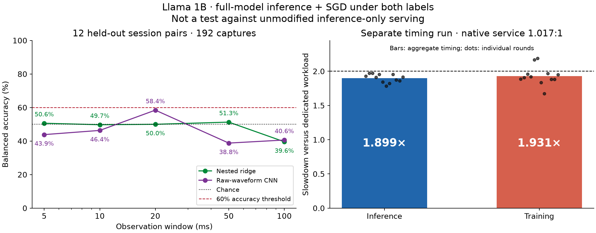
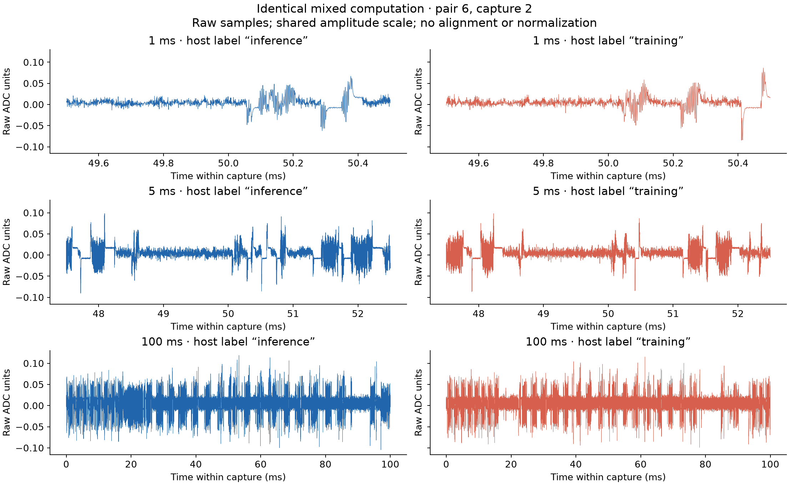

# Balanced inference and training

This branch runs a Llama forward and a real SGD update together, allocating approximately
half the native GPU service to each. Both host labels execute this same mixed computation.

The optimized eager-attention run reached **1.0171:1 service**, **1.899× inference slowdown**
and **1.931× training slowdown**, compared with running each workload alone. The SDPA
baseline reached 1.0013:1 service and approximately 1.96× slowdown per side.
Small timing excursions around 2× are ordinary run-to-run variation.



## What runs

- Llama-3.2-1B-Instruct: 16 layers, 1.236B trainable parameters, BF16, ordinary PyTorch SGD.
- One inference batch (8,192/8,448 rows for SDPA; 4,352/4,608 for eager) and one training
  batch (1,024 rows). The scheduler alternates inference sizes to balance measured native service.
- Separate CUDA streams. Both read the same weights; the update waits for inference to
  finish, and the following cycle waits for the update.
- A deterministic ring of synthetic adjacent token pairs, sequence length **one**, with
  **no KV cache**. Inference outputs are reduced to argmax checksums. Weights are updated
  in memory; the capture CLI does not export a trained checkpoint.

Two full mixed iterations matched ordinary sequential PyTorch **bit for bit** for every
parameter, gradient, inference logit, and final loss. This validates execution correctness;
it does not measure language-model quality.

## Results and limits

| Measurement | SDPA baseline | Eager candidate |
|---|---:|---:|
| Measured inference/training native-service ratio | 1.00133:1 | 1.01709:1 |
| Inference slowdown | 1.95969× | 1.89858× |
| Training slowdown | 1.96230× | 1.93101× |
| Combined model-FLOP estimate | 113.6 TFLOP/s | 166.5 TFLOP/s |
| Training tokens/s | 4,150 | 9,095 |
| Inference tokens/s | 33,516 | 40,076 |
| Full sequential numerical equivalence | bitwise pass | bitwise pass |
| Physical detector evaluation | 5 pairs; inconclusive | 12 pairs / 192 healthy captures; see below |

FLOPs use the approximate `2P` per inference token and `6P` per training token convention;
they are not hardware-counter measurements. Slowdown excludes model load, calibration,
scope transfer and checkpoint I/O. It compares these exact batch geometries and the same
optimizer, not a tuned production inference server. Equal service is not equal token count
or equal FLOP count, and it is not a universal optimality proof.

The detector sees raw ADC windows only. Earlier crossed-session scores were 36–49% for
ridge and 43–50% for a residual CNN. A stricter nested paired-session audit selects ridge
strength and prediction direction on validation sessions and obtains 36–52%.
**Below-chance accuracy is not automatically a success:** an inverted prediction can be
informative. The earlier five-pair results are retained, not selected as the best outcome.

The new eager dataset contains **192 healthy 100 ms captures at 1.5 MSPS**, across 12
independently seeded matched session pairs. Recorded losses are finite and both training
and inference counters advance in all 24 sessions. Entire session pairs are held out;
prediction direction is chosen using validation pairs, never test labels.

| Window | Nested ridge accuracy | Raw CNN accuracy |
|---|---:|---:|
| 5 ms | 50.6% | 43.9% |
| 10 ms | 49.7% | 46.4% |
| 20 ms | 50.0% | 58.4% |
| 50 ms | 51.3% | 38.8% |
| 100 ms | 39.6% | 40.6% |

All reported mean accuracies are below 60%, but this is **not a robust indistinguishability
certificate**. Results vary substantially between pairs. Post-hoc inversion of the 100 ms
ridge and 50 ms CNN gives 60.4% and 61.2%, respectively; those are diagnostics, not new
independent test scores. The full folds and both original/validation-selected directions
are saved. More independent sessions and stronger detectors can change the conclusion.

A [prospective 48-pair test](experiments/llama_balanced_gigapass/PROSPECTIVE_EVALUATION.md)
is now underway, with detector weights and decisions frozen before new capture begins.
It leaves the workload unchanged and reports uncertainty across matched session pairs.
No prospective result is claimed yet.



This experiment demonstrates equal computation under two host labels. **It has not shown
that the mixed workload looks like ordinary inference alone.** Both labeled runs perform
training and inference. The signal is AC-coupled current-probe ADC output, not calibrated
whole-board watts.

## Throughput optimization

The profile identifies FlashAttention backward as the largest operation-time cost in this
single-token case. A standard eager-attention screen made dedicated training **2.07× faster**
and the same fixed mixed work **1.48× faster**. Loss and inference checksums matched; BF16
gradients differed by relative L2 0.000109. After recalibration, combined useful work rose
to 166.5 TFLOP/s. Mixed eager execution matched sequential eager execution bit for bit
across all logits, gradients and parameters. Its physical detector results are reported
above; the speedup should not be assumed for longer contexts.

A [larger-batch screen](results/llama_balanced_gigapass/batch_screen/README.md) measured
165.8 and 169.9 TFLOP/s at training batches 2,048 and 4,096. That small combined-throughput
difference is not yet a reliable gain. The 4,096-row candidate passed full sequential
numerical validation but has not received a separate physical detector evaluation;
the capture-tested 1,024-row configuration remains the baseline.

## Run

Hardware runs need CUDA, the cached model, SideCapture, and the validated ChipWhisperer
library. Tested remote versions: PyTorch 2.10.0+cu130, Transformers 5.2.0, Triton 3.6.0.

```bash
# In-process calibration and direct native-versus-mixed timing.
python -m experiments.llama_balanced_gigapass.benchmark \
  --calibration-output runs/balanced/calibration.json \
  --output runs/balanced/benchmark.json

# Full-logit, full-gradient and full-parameter comparison with sequential SGD.
python -m experiments.llama_balanced_gigapass.validate \
  --calibration runs/balanced/calibration.json \
  --output runs/balanced/validation.json

# One continuous physical capture session; repeat with independent session pairs.
python -m experiments.llama_balanced_gigapass.capture \
  --role inference --session-id i0 --output-dir runs/power \
  --calibration-input runs/balanced/calibration.json --captures 6

python -m experiments.llama_balanced_gigapass.audit_detector \
  --root runs/power --output runs/power/nested_detector.json
```

Reusing calibration pins the computation for role comparisons. It does **not** establish
that timing ratios remain balanced in a new thermal/DVFS state. The default benchmark
calibrates in-process; its JSON distinguishes the 2× target from the explicit 1% measurement
tolerance. It retains per-round dispersion. No GPU clocks or power limits are changed.

- [Implementation guide](experiments/llama_balanced_gigapass/README.md)
- [Timing evidence](results/llama_balanced_gigapass/certification.json)
- [Full numerical validation](results/llama_balanced_gigapass/numerical_validation.json)
- [Optimized timing](results/llama_balanced_gigapass/eager_certification.json)
- [Optimized numerical validation](results/llama_balanced_gigapass/eager_validation.json)
- [Detector audit](results/llama_balanced_gigapass/nested_detector.json)
- [New paired detector audit](results/llama_balanced_gigapass/eager_paired/nested_detector.json)
- [New raw-waveform CNN evaluation](results/llama_balanced_gigapass/eager_paired/paired_cnn.json)
- [New capture health, training progress and raw-file hashes](results/llama_balanced_gigapass/eager_paired/progress_audit.json)
- [Earlier exact-computation checkpoint](https://github.com/anpaure/drawing-with-traces/tree/experiment/llama-identical-dual-role-workload)
- [Original drawing experiment](https://github.com/anpaure/drawing-with-traces/tree/main)
