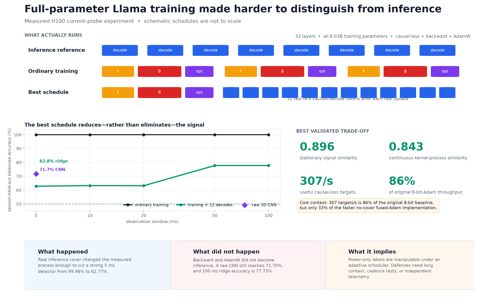
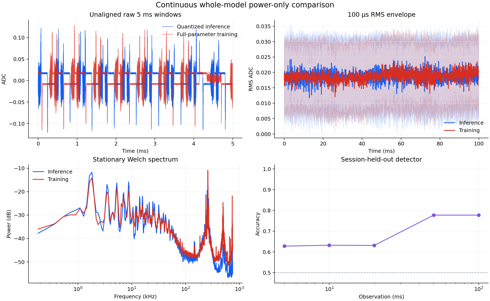

# Can full-parameter Llama training look like inference in a power trace?

This branch contains the **continuous whole-model Llama experiment**. It compares real cached inference
with real full-parameter training as seen by an external current probe. The PNG-drawing project remains
on [`main`](https://github.com/anpaure/drawing-with-traces/tree/main); the earlier GPT-OSS study is on
[`experiment/gpt-oss-inference-shaped-training`](https://github.com/anpaure/drawing-with-traces/tree/experiment/gpt-oss-inference-shaped-training).



## Answer

**Partly, at a real cost.** Ordinary training is essentially trivial to distinguish from inference.
The best tested schedule performs one genuine training update and then 12 genuine NF4 cached-decode
tokens. It makes short power windows substantially harder to classify, but it does not erase the
training signal.

| External monitor result | Ordinary training | Best schedule |
|---|---:|---:|
| 5 ms ridge balanced accuracy | **99.98%** | **62.77%** |
| 5 ms raw-waveform CNN | — | **71.70%** |
| 100 ms ridge balanced accuracy | **100.00%** | **77.73%** |
| Stationary signal similarity to inference | 0.678 | **0.896** |
| Useful causal-loss targets/s | 356 | **307** |

Chance is 50%. Splits hold out complete workload sessions, not random windows from the same trace.
The 307 targets/s result retains 86% of the original 8-bit-Adam baseline, but only 33% of the faster
no-cover fused-Adam implementation. The camouflage is useful computation, not free computation.

## What actually ran

### Inference reference

- `meta-llama/Llama-3.1-8B`, all 32 layers;
- NF4 double-quantized weights with BF16 compute;
- changing prompt prefills and genuine autoregressive KV-cached decode.

### Training target

- the same 32-layer architecture in BF16;
- all **8,030,261,248 parameters** and all 291 parameter tensors trainable;
- causal loss, full forward, reverse-mode backward, and AdamW update;
- changing token slices; every parameter tensor receives a gradient and belongs to the optimizer.

### Best schedule

- one complete fused-AdamW training update;
- then 12 real decode tokens from a second NF4 model with a real KV cache;
- repeated continuously before the scope is armed.

The monitor receives only current-probe ADC samples. It does not receive CUDA markers, iteration
boundaries, labels, loss, model metadata, NVML, or host timing. Every 100 ms capture starts after an
independent random 0–500 ms armed delay.



## What worked—and what failed

1. **Real inference cover worked best.** It changes the whole kernel and physical process, including
   cadence, quantized GEMMs, memory traffic, and idle gaps.
2. **Making individual matmuls look like decode did not work.** Exact token-row decomposition made 96%
   of profiled ATen GEMMs use `M=1`, yet kernel-process similarity fell from 0.411 to 0.342 and useful
   training throughput fell about 30×.
3. **Marginal waveform similarity was not enough.** Randomized cover reached the highest stationary
   similarity (0.931) but was easier to detect than fixed cover-12. Layer-interleaved cover reached
   0.919 similarity but 96.88% detector accuracy at 100 ms because its cadence was regular.
4. **Longer observation still helps the defender.** The best ridge result rises from 62.77% at 5 ms to
   77.73% at 100 ms, and the raw CNN reaches 71.70% at 5 ms.

The practical lesson is that matching one kernel shape, spectrum, or amplitude distribution is only a
proxy. The objective must be evaluated with held-out temporal detectors on the physical channel.

## What this proves—and does not prove

**Supported by this experiment**

- An adaptive scheduler can materially manipulate a power-only workload classifier.
- Full-parameter transformer training can continue while real inference cover changes its measured
  signature.
- Short observation windows are much more vulnerable than long ones.

**Not supported**

- Backward or AdamW became mathematically equivalent to inference.
- Training is universally indistinguishable: both tested detectors retain signal.
- Every sensor is broken. A faster, independent, longer-horizon, or multi-modal monitor may do better.
- The result transfers unchanged to another GPU, probe, model, serving mix, or software stack.

## Comparison with `jacobcd52/silhouette`

[`jacobcd52/silhouette`](https://github.com/jacobcd52/silhouette) is a useful implementation of a
related but different problem. Its strongest documented 2-second controller identifies an A100→NVML
channel, deconvolves it, and uses iterative learning control to reproduce an arbitrary contour. Its
reported training-on run reaches 3.05% mean absolute error over the target span and 0.9876 correlation.

| | This branch | `silhouette` at commit `7042c4e` |
|---|---|---|
| Goal | Make independently defined inference and training harder to classify | Draw a chosen target curve |
| Sensor | External clamp + ChipWhisperer, 1.5 MSPS | In-process NVML, 49.8 Hz |
| Workload | Whole Llama training continuously, plus decode cover | ResNet-18 training for 67% of the trace; calibrated filler matmuls elsewhere |
| Control | Fixed schedules evaluated on held-out sessions | System identification, deconvolution, and target-specific feedback |
| Primary evidence | Inference-vs-training detector accuracy | Replay MAE/correlation to the chosen contour |

`silhouette` is stronger at **closed-loop waveform tracking**. This branch is stronger evidence for
**workload camouflage against an external observer**. The former does not test whether training looks
like an independent inference process; the latter does not attempt to draw an arbitrary target.
See its [controller](https://github.com/jacobcd52/silhouette/blob/7042c4eac5a7456fa38e0d8821189da8db5b0378/power_trace_2s.py),
[workload engine](https://github.com/jacobcd52/silhouette/blob/7042c4eac5a7456fa38e0d8821189da8db5b0378/s2s.py),
and [2-second analysis](https://github.com/jacobcd52/silhouette/blob/7042c4eac5a7456fa38e0d8821189da8db5b0378/ANALYSIS_2S.md).

## Reproduce and inspect

The hardware run requires the cached Llama checkpoint, SideCapture, the validated ChipWhisperer fork,
and the installed H100 sensor chain.

```bash
python experiments/llama_continuous_whole_model/benchmark_schedule.py \
  --sequence-length 128 --optimizer adamw_fused \
  --cover-decode-tokens-per-microbatch 12 \
  --output runs/fused-cover12-benchmark.json

python experiments/llama_continuous_whole_model/capture_continuous.py \
  --mode inference --session-id inference-00 \
  --output-dir runs/fused-cover12 --captures 8

python experiments/llama_continuous_whole_model/capture_continuous.py \
  --mode training --session-id training-00 \
  --output-dir runs/fused-cover12 --captures 8 \
  --optimizer adamw_fused --cover-decode-tokens-per-microbatch 12

python experiments/llama_continuous_whole_model/analyze_continuous.py \
  --root runs/fused-cover12
```

- [Compact final metrics](results/llama_continuous_whole_model/final_summary.json)
- [Kernel audit](results/llama_continuous_whole_model/kernel_audit_summary.json)
- [Hardware and software provenance](results/llama_continuous_whole_model/provenance.json)
- [Method and file guide](experiments/llama_continuous_whole_model/README.md)
