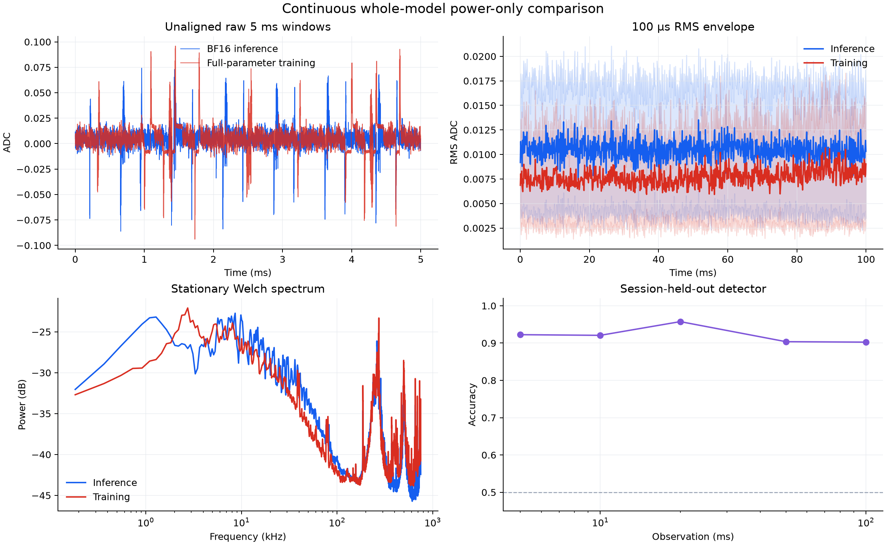

# No-cover inference-shaped Llama training

Can full-parameter transformer training look like cached inference to an external current probe **without
running inference as cover**?

**Not yet.** The best tested schedule makes several marginal signal statistics close, but a session-held-out
power-only detector still separates training from inference with **90.25–95.75% balanced accuracy**.



## Result

| Measured quantity | Best no-cover run |
|---|---:|
| Raw-amplitude JS similarity | 0.9924 |
| Normalized-amplitude JS similarity | 0.9909 |
| Welch-PSD JS similarity | 0.9418 |
| Mean stationary similarity | **0.9750** |
| Detector accuracy, 5 ms | **92.25%** |
| Detector accuracy, 20 ms | **95.75%** |
| Detector accuracy, 100 ms | **90.25%** |
| Useful causal-loss targets/s | **578** |
| Ordinary-training targets/s | **5,311** |
| Throughput retained | **10.9%** |

Chance detector accuracy is 50%. The detector receives only contiguous ChipWhisperer ADC windows. Each
fold leaves out one complete inference session and one complete training session; it does not randomly
split neighboring windows from the same session.

The physical evaluation contains five independent sessions per process and eight healthy 100 ms traces
per session: 40 inference traces and 40 training traces, sampled at 1.5 MSPS.

## What actually ran

### Reference inference

- `unsloth/Llama-3.2-1B-Instruct`, 16 layers, BF16, 1.235B parameters;
- batch 1,024, real KV-cached autoregressive decode;
- one model instance in the inference worker.

### Shaped training

- the same BF16 checkpoint, all 1.235B parameters trainable;
- batch 128 × sequence length 1, causal cross-entropy, full forward/backward, and SGD update;
- one fixed synthetic token batch per session, replayed to isolate scheduler and sensor behavior;
- 113 dense modules replaced by shaped but mathematically valid linear operators;
- one model instance in the training worker;
- **zero inference tokens, zero inference cover, and zero filler kernels**.

Every scheduled GEMM contributes to forward, `dX`, exact `dW`, or explicitly reported reduction-padding
work. Non-GEMM transformer and optimizer operations are still real parts of the same training update.
This is a systems-side-channel experiment, not a language-model convergence benchmark.

## Selected mechanism

1. Forward and `dX` are submitted as groups of genuine shared-RHS `M=1` products. The
   `grouped-m1` backend label applies to these two paths, not deferred `dW`.
2. Each `dW` is formed exactly from its saved activation and output gradient. The reduction dimension is
   padded to an inference-like width; padding is redundant training arithmetic, not hidden work.
3. Dependency-ready `dW` tiles stream through `torch._grouped_mm`: 2,576 logical tiles become 176
   physical GEMM launches (160 grouped launches plus 16 singletons).
4. Parameter updates are interleaved with backward and fused in eight-tensor buckets.
5. A complete update is replayed through a CUDA graph to remove Python launch stalls.

The important cost is explicit: only **0.316 TFLOP** of each shaped `dW` is useful, while **8.044 TFLOP**
is reduction-padding overhead. Thus 96.2% of executed `dW` arithmetic is redundant. This is the main
reason the selected run is 9.18× slower than the ordinary CUDA-graph baseline.
That baseline uses the same full-parameter SGD rule and batch geometry, but ordinary dense linear
operators and no shaping.

## Why the claim remains negative

The waveform plot can look close while a detector uses stable temporal differences. Profiling one update
shows 595 dense training kernels taking 177.2 ms, versus 114 dense kernels taking 5.58 ms for one cached
decode. Training also retains backward attention, reductions, optimizer traffic, packing, and a different
short-timescale envelope. Marginal amplitude and PSD similarity do not erase those features.

The independent alternatives tested here did not solve that problem:

| Variant | Evaluation | Similarity | Useful targets/s | Outcome |
|---|---|---:|---:|---|
| Streaming grouped, batch 128 | 5-session final | **0.975** | 578 | Selected, but detector stays >90% |
| Streaming round-robin, batch 128 | 5-session final | 0.978 | 589 | Slightly better stationary score; worse detector overall |
| Inference-family cyclic scheduler | 1-session smoke | 0.963 | 600 | Reordering alone did not improve the trace |
| Replace padding with batch 2,048 useful rows | 1-session smoke | 0.872 | **832** | 43% faster, but PSD similarity collapsed to 0.630 |
| Eager execution | 1-session smoke | 0.901 | 398 | Natural host gaps created a strong periodic signature |
| Explicit 800 µs host pacing | 1-session smoke | 0.705 | 236 | AC-coupled transitions became much larger |
| Append a gradient actuator after updates | 1-session smoke | 0.877 | — | Two separable regimes; not integrated shaping |

Single-session similarities are triage measurements, not substitutes for held-out detector evidence.
Machine-readable values are in
[`ablations/summary.json`](results/llama_strict_inference_shaped_training/ablations/summary.json).

A subsequent physical actuator sweep varied exact-gradient tile width, operation count, fixed cadence,
and aperiodic schedules. None reached the required **<60% balanced-accuracy** gate. The best complete
actuator control still scored 85.1–86.3% across 5–100 ms; a fixed-classifier screen that appeared better
reverted to 93.8–96.1% when evaluated correctly with fresh sessions and a retrained attacker. This rules
out appending a PyTorch-level carrier as the solution, not the broader shared-kernel hypothesis. See the
[compact control summary](results/llama_strict_inference_shaped_training/actuator_controls/summary.json).

## Numerical validation

Two different statements are validated and kept separate:

- **Fusion equivalence within the shaped algorithm:** scalar versus eight-tensor fused updates have
  identical loss, every gradient value equal, and every updated parameter value equal across all 1.235B
  parameters.
- **Selected grouped-M1 backend versus ordinary BF16 PyTorch:** the operations are algebraically exact,
  but a different BF16 reduction order gives gradient relative L2 `0.004759`. Updated parameters have
  relative L2 `8.27e-7` and 99.9989% element equality after one step. This is not claimed to be bitwise
  ordinary PyTorch.

## Controls and related branches

- [`main`](https://github.com/anpaure/drawing-with-traces/tree/main) draws arbitrary contours with real
  gradient computation. It is a waveform-control experiment, not inference-vs-training camouflage.
- [`experiment/llama-continuous-whole-model`](https://github.com/anpaure/drawing-with-traces/tree/experiment/llama-continuous-whole-model)
  runs a second NF4 model and genuine decode tokens between training updates. It is a useful **inference-cover
  control**, but it does not meet this branch's zero-cover constraint.
- [`experiment/gpt-oss-inference-shaped-training`](https://github.com/anpaure/drawing-with-traces/tree/experiment/gpt-oss-inference-shaped-training)
  also contains decode-cover results and should be read as a control for this stricter question.

## Reproduce

Hardware execution requires an H100, the cached model, SideCapture, and the validated ChipWhisperer fork.

```bash
# Compare the selected backend with ordinary BF16 training.
python -m experiments.llama_strict_inference_shaped_training.validate_strict \
  --training-batch-size 128 --sequence-length 1 --tile-rows 128 \
  --shaping-backend grouped-m1 \
  --weight-gradient-schedule streaming-grouped \
  --streaming-dw-tasks-per-record 16 \
  --grouped-dw-min-batch 4 --grouped-dw-max-batch 16 \
  --optimizer-bucket-size 8 --output runs/selected-validation.json

# Prove optimizer fusion is bitwise identical within the shaped algorithm.
python -m experiments.llama_strict_inference_shaped_training.validate_optimizer_fusion \
  --training-batch-size 128 --sequence-length 1 --tile-rows 128 \
  --shaping-backend grouped-m1 \
  --weight-gradient-schedule streaming-grouped \
  --streaming-dw-tasks-per-record 16 \
  --grouped-dw-min-batch 4 --grouped-dw-max-batch 16 \
  --reference-bucket-size 1 --fused-bucket-size 8 \
  --output runs/fusion-validation.json

# Capture one continuous training session. Repeat with distinct session IDs/seeds.
python -m experiments.llama_strict_inference_shaped_training.capture_strict \
  --mode shaped-training --session-id training-s0 --seed 5100 \
  --output-dir runs/final --captures 8 --duration 100ms --sample-rate 1.5MHz \
  --training-batch-size 128 --sequence-length 1 --tile-rows 128 \
  --shaping-backend grouped-m1 \
  --weight-gradient-schedule streaming-grouped \
  --streaming-dw-tasks-per-record 16 \
  --grouped-dw-min-batch 4 --grouped-dw-max-batch 16 \
  --optimizer-bucket-size 8

python -m experiments.llama_continuous_whole_model.analyze_continuous \
  --root runs/final --horizons-ms 5,10,20,50,100
```

- [Implementation and file guide](experiments/llama_strict_inference_shaped_training/README.md)
- [Compact machine-readable summary](results/llama_strict_inference_shaped_training/summary.json)
- [Hardware and software provenance](results/llama_strict_inference_shaped_training/provenance.json)
- [Full committed evidence](results/llama_strict_inference_shaped_training/README.md)
