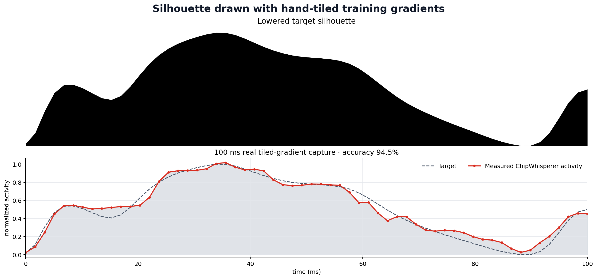
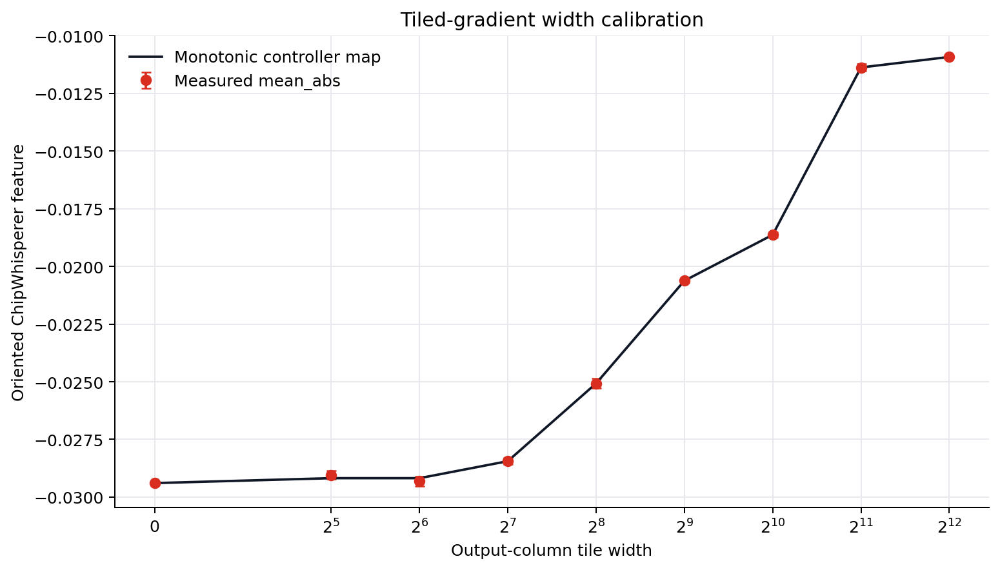
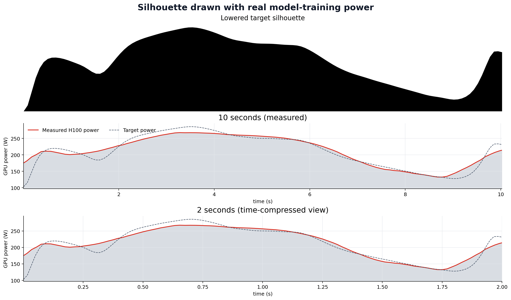
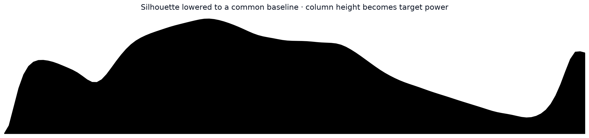

# Drawing with traces

Train a real model while shaping its measured GPU power activity into an image silhouette.

This is a standalone experiment built on [SideCapture](https://github.com/anpaure/sidecapture).
It does not synthesize, replace, or geometrically warp measured values.



## Best real-hardware result

| Property | Result |
|---|---:|
| Requested profile duration | **100 ms** |
| Controlled bins | 60 |
| ChipWhisperer rate | 1.5 MSPS burst |
| Model parameters | 16,777,216 |
| Pearson correlation | **0.9861** |
| Normalized MAE | **4.34%** |
| Normalized RMSE | **5.54%** |
| R² | **0.9687** |
| Shape accuracy (`100 × (1 − NRMSE)`) | **94.46%** |
| Training loss | **0.99772 → 0.83642** |

Hardware: NVIDIA H100 PCIe and ChipWhisperer Husky Plus. The committed result includes the raw
163,500-sample SideCapture trace, explicit bin annotations, health report, exact commands, calibration,
and derived arrays under [`results/fast-100ms`](results/fast-100ms).

## How the millisecond version works

A filled 2D shape first becomes a valid one-dimensional target:

1. Extract the foreground mask.
2. Measure the foreground height in every image column.
3. Move every column down to a common baseline.
4. Smooth and normalize the resulting height envelope.

The fast workload is then a hand-written tiled gradient for

```text
loss = 0.5 / batch × ||XW − Y||²
gradient = Xᵀ(XW − Y) / batch
```

Every controlled tile computes both `X @ W[:, start:end]` and its real gradient block
`X.T @ residual[:, start:end]`. Tile width changes the GEMM shape and therefore the measured GPU
activity. Repeated visits are averaged by output column before one deferred SGD update, so changing the
power pattern does not change the mathematical gradient.

On the H100, the tiled result matched the full untiled manual gradient exactly in the validation run
(`relative L2 = 0`, `max absolute difference = 0`). Every accepted iteration reduced the model loss.

## Calibration and iterative learning control

The first SideCapture run sweeps tile widths from idle through 4096 columns and back. It automatically
chooses the most monotonic ChipWhisperer feature and builds a width-to-activity map.



The image envelope is inverted through that calibration. Subsequent real captures use iterative learning
control (ILC): measured per-bin error adjusts the next tile-width sequence. The best of eight 100 ms
captures was iteration 5.

## Reproduce the 100 ms experiment

```bash
python -m pip install -e .

drawing-with-traces fast \
  --image assets/target.png \
  --output runs/fast-100ms \
  --duration-ms 100 \
  --iterations 8 \
  --ilc-gain 0.35
```

SideCapture provides:

- `ChipWhispererSampler` acquisition and hardware planning;
- trigger-to-host annotation mapping;
- ADC clipping, finite-value, expected-length, variance, flatline, and bounds validation;
- automatic retries and sampler recovery;
- crash-safe records, raw channels, labels, artifacts, and provenance.

The 100 ms feature is normalized AC-coupled ChipWhisperer activity, **not calibrated watts**.

## Seconds-scale watts mode

For slow absolute-power drawings, the project also supports SideCapture's timestamped NVML sampler. The
installed ChipWhisperer path is high-pass/AC-coupled, so NVML is the honest source for curves expressed in
watts over seconds.

The measured 10-second adaptive run reached 92.04% shape accuracy and `r = 0.9583`:



```bash
drawing-with-traces run \
  --image assets/target.png \
  --output runs/h100-silhouette \
  --duration-s 10 \
  --adaptive
```

## Target preview

```bash
drawing-with-traces preview \
  --image assets/target.png \
  --output results/target-envelope.png
```



## Measurement integrity

- Raw traces are committed before optimizer state changes.
- Rejected captures clear gradients and retry without applying an update twice.
- Exact target values, tile commands, operation counts, model configuration, and timing are stored.
- Accuracy uses the unshifted measured curve; no lag shifting is applied to the plotted data.
- The plotted fast curve uses the calibration-selected feature and a documented 0.8-bin Gaussian display
  smoothing. Raw per-bin values remain available beside it.
- Hardware retries remain visible through each record's `attempt` and rejection log.
