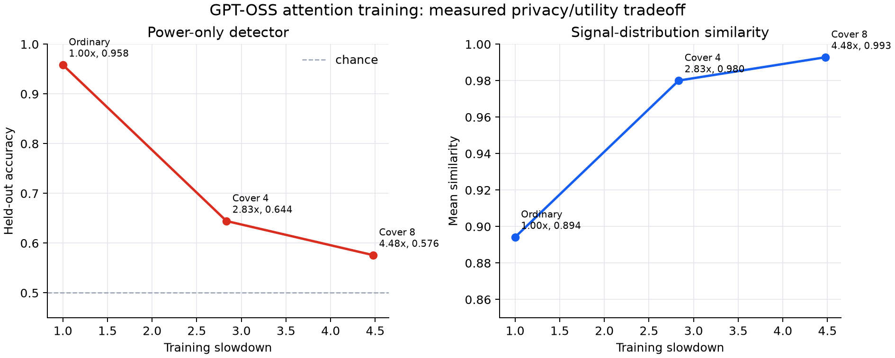
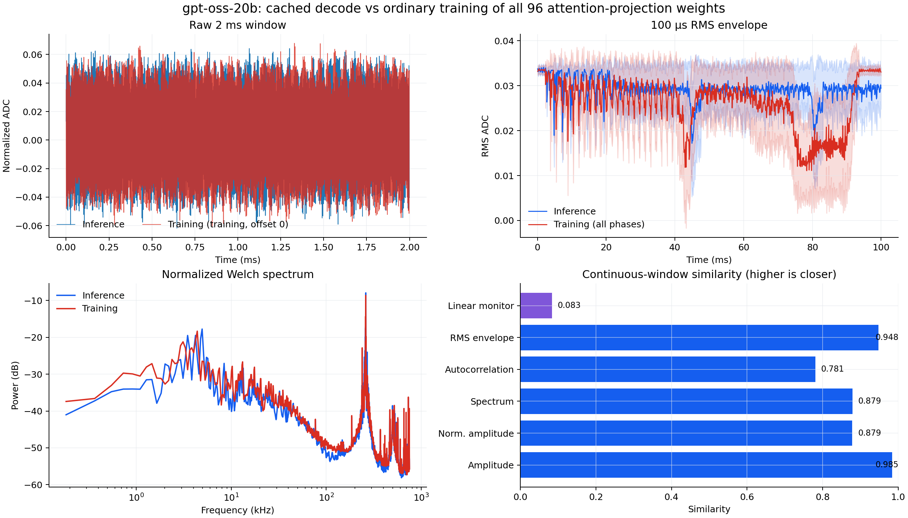

# GPT-OSS inference-shaped training

This experiment asks whether genuine GPT-OSS training can be scheduled so its measured H100 power
activity resembles one-token cached inference. It combines CUDA-kernel profiling, an exact
inference-shaped linear-gradient construction, physical ChipWhisperer captures, and a power-only
detector.

> **Scope:** this branch is a controlled proof of mechanism. The strongest physical run updates all
> 96 q/k/v/o attention-projection weights (637,009,920 parameters) while executing a complete
> GPT-OSS-20B forward and backward pass. It does **not** update every model parameter, and acquisition
> begins at a known workload call with rotated phase offsets. Persistent unsynchronized whole-model
> training and realistic serving are follow-up work, not claims made by these results.

## Matched physical result

The final matched run uses identical initial weights, prompt, optimizer, accepted update count, scope,
and acquisition settings for ordinary and covered training. Every accepted training trajectory is the
same: causal loss falls from `6.722904` to `0.012314` over 27 real updates.

| Process seen through a random 100 ms window | Signal similarity | Power-only linear detector | Mean CUDA time / update cycle | Slowdown |
|---|---:|---:|---:|---:|
| Ordinary attention training | 89.42% | **95.83%** | 91.34 ms | 1.00x |
| Training + 4 cached-decode covers | 98.01% | **64.44%** | 254.17 ms | 2.83x |
| Training + 8 cached-decode covers | **99.28%** | **57.59%** | 408.86 ms | 4.48x |



The detector receives only features computed from ChipWhisperer ADC samples: amplitude statistics,
quantiles, spectral bands, differences, and crossing/higher-moment statistics. It receives no CUDA
markers, phase offset, model metadata, timing counters, loss, or NVML data. Evaluation holds out one
complete inference trace and one complete training trace per fold.




### Important qualification

The cover-8 aggregate contains three examples of every cycle offset. Its detector accuracy by offset is:

| First cycle offset | 0 | 1 | 2 | 3 | 4 | 5 | 6 | 7 | 8 |
|---|---:|---:|---:|---:|---:|---:|---:|---:|---:|
| Accuracy | **80.83%** | 53.33% | 49.17% | 51.67% | 48.33% | 55.00% | 54.17% | 53.33% | **72.50%** |

Offset 0 starts with training; offset 8 starts with one decode and then training. Most other 100 ms
windows are dominated by cached-decode cover. Therefore, `57.59%` is a valid aggregate for this rotated
window distribution, but it does not prove that an indefinitely observing external monitor cannot
accumulate evidence from recurring backward regions. It also does not represent a truly untriggered
continuous process. Both limitations are explicit in the saved metrics.

## What the kernel audit found

A real batch-one cached decode and two-token training pass share much of the forward kernel order, but
backward and optimizer work are structurally different:

| Phase | Actual CUDA launches | GPU busy time | Family-duration match to decode | Family-sequence match |
|---|---:|---:|---:|---:|
| Cached decode | 1,641 | 6.262 ms | 100% | 100% |
| Training forward | 1,498 | 7.252 ms | **81.08%** | **92.07%** |
| Training backward | 1,733 | 7.211 ms | **43.70%** | **55.42%** |
| Optimizer | 88 | 12.642 ms | 0% | 0% |

The primary mismatch is consequently not the transformer forward pass. It is the transposed GEMM
geometry, reductions, ordering, and optimizer kernels introduced by reverse-mode differentiation.
Compact profiler evidence is under
[`results/gpt_oss_inference_shaped_training/kernel_audit`](../../results/gpt_oss_inference_shaped_training/kernel_audit).

## Exact inference-shaped gradient construction

For a linear layer,

```text
y  = x W^T
dX = dY W
dW = dY^T x
```

The transpose of `dW` can be constructed one input-feature row at a time:

```text
dW^T[j, :] = x[:, j]^T dY
```

Padding the token reduction with zeros to the projection input width changes this into an
`M=1, K=in_features, N=out_features` GEMM: the same geometry as one-token inference. Padding contributes
exactly zero, so the operation computes a real gradient rather than a surrogate workload.

The balanced layer-2 `o_proj` experiment accumulated 4,096 real causal activation/gradient rows and
then scheduled:

* 4,096 inference-shaped forward GEMMs;
* 4,096 inference-shaped data-gradient GEMMs;
* 4,096 inference-shaped weight-gradient GEMMs.

Each stream performs 96,636,764,160 useful FLOPs, giving the expected backward/forward ratio of 2.0.
The data gradient is bitwise identical; the weight gradient has relative L2 error `1.253e-4` from BF16
reduction ordering and 99.9596% element equality. Kernel-process similarity rises from 36.12% for the
ordinary local projection to **93.99%** for the balanced schedule.

That kernel match is not free: launch serialization makes the local shaped projection 1,705 ms versus
35 ms ordinarily. More importantly, dense runs of identical tiny kernels create a recognizable power
cadence at full-model scale.

## Negative result retained intentionally

Training only the final layer's four attention projections reduces ordinary detector accuracy to
87.78%, because backward can terminate earlier. Applying 128 inference-shaped dW rows raises signal
similarity slightly (89.43% to 90.21%) but makes detector accuracy **worse**, at 95.56%, and increases
the median three-step CUDA time from 122.97 ms to 197.18 ms.


This is evidence against the simplistic strategy “make every individual matmul look like inference.”
Temporal composition matters: a repeated burst can be more identifiable than one ordinary training
GEMM even when every burst element has the target geometry.

## Capture configuration

All committed physical summaries use the same installed chain:

* NVIDIA H100 PCIe;
* PicoScope TA189 current clamp on the auxiliary PCIe supply conductors;
* 6 dB attenuator into ChipWhisperer Husky Plus measurement-positive input;
* ChipWhisperer `6.0.0+isl.1` stability fork;
* burst acquisition, 1.5 MSPS, 100 ms, 150,000 float32 samples, 12-bit, 10 dB gain;
* SideCapture retry, health validation, and transactional workload restoration.

The TA189 is specified flat only through 100 kHz, and the Husky input is AC-coupled/high-pass near
100 kHz. Values are therefore normalized ADC activity, not calibrated watts. Comparisons remain useful
because every variant uses the same analog chain, but MHz-band interpretation is out of probe spec.

## Reproduction

The H100 validation environment used Python 3.14.3, PyTorch `2.10.0+cu130`, Transformers `5.2.0`,
SideCapture at the commit pinned by this repository, and ChipWhisperer `6.0.0+isl.1`.

Run the exact linear/kernel experiment from this directory:

```bash
python run_experiment.py \
  --output-dir runs/layer2_rows128 \
  --layer 2 \
  --tokens 2 \
  --weight-gradient-inference-rows 128
```

Run the balanced 1:2 stream:

```bash
python run_balanced_projection.py \
  --output-dir runs/balanced4096 \
  --layer 2 \
  --total-rows 4096 \
  --microbatch-rows 256
```

Run the matched physical all-attention experiment:

```bash
python capture_full_model_power.py \
  --output-dir runs/cover8_matched \
  --all-attention-projections \
  --traces-per-process 27 \
  --decode-repeats 3 \
  --training-repeats 1 \
  --duration 100ms \
  --sample-rate 1.5MHz \
  --gain-db 10 \
  --shaped-inference-rows 0 \
  --shaped-forward-rows 2 \
  --shaped-input-gradient-rows 2 \
  --shaped-cover-decodes 8

python analyze_power_capture.py --root runs/cover8_matched/ordinary
python analyze_power_capture.py --root runs/cover8_matched/shaped
```

Raw physical records are intentionally not committed. Compact health, timing, per-trace statistics,
detector folds, metrics, and plots are under
[`results/gpt_oss_inference_shaped_training`](../../results/gpt_oss_inference_shaped_training).

## Files

| File | Purpose |
|---|---|
| `kernel_profile.py` | Whole-model decode/forward/backward/optimizer profiler |
| `inference_shaped_linear.py` | Exact row-tiled linear autograd implementation |
| `run_experiment.py` | Controlled layer-2 kernel experiment |
| `run_balanced_projection.py` | Balanced 4,096-row 1:2 stream |
| `capture_projection_power.py` | Physical isolated-projection captures |
| `capture_full_model_power.py` | Matched GPT-OSS attention-training captures |
| `analyze_power_capture.py` | Power-only metrics, grouped detector, and figures |
| `continuous_similarity.py` | Boundary-free kernel-process metrics |
