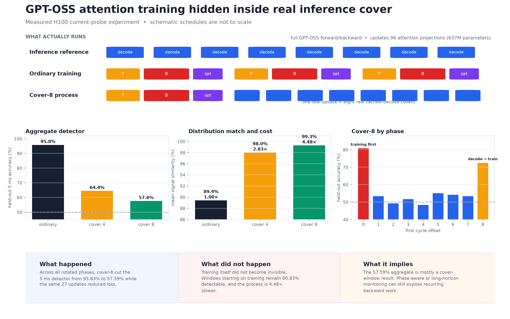
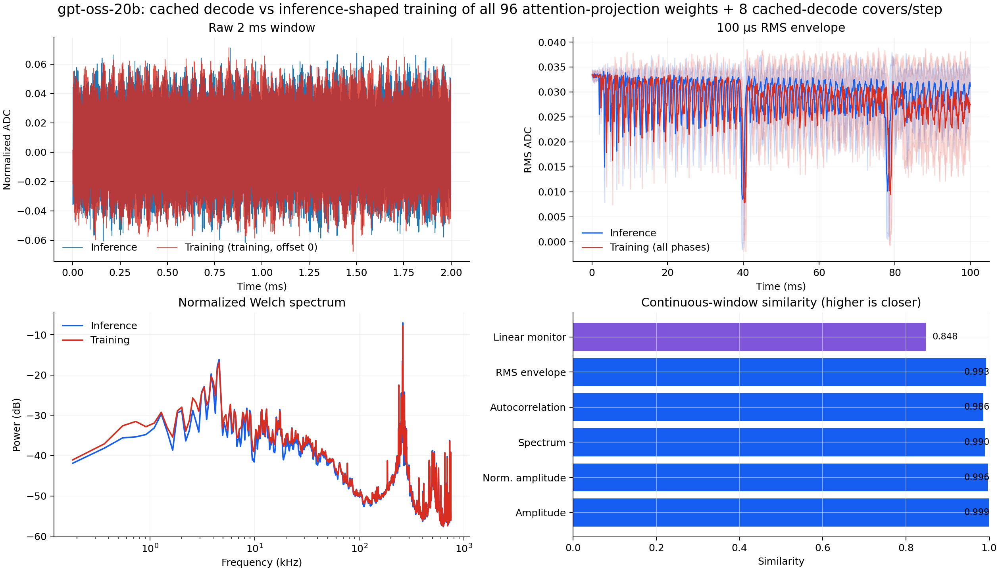
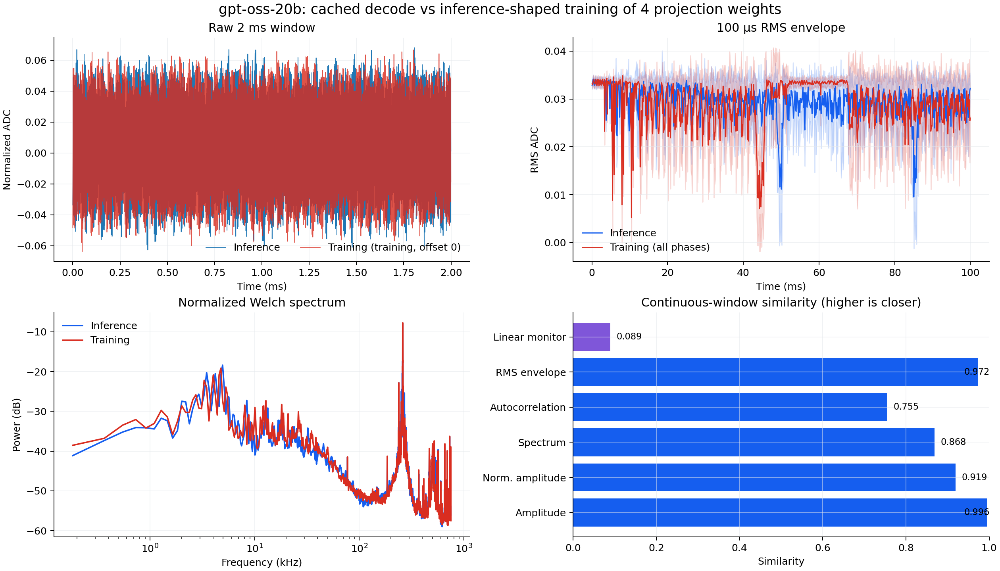

# GPT-OSS inference-shaped training: method and evidence

This directory implements the controlled experiment summarized in the [branch README](../../README.md).
It contains three distinct tests that should not be conflated:

1. a whole-model CUDA audit of decode, forward, backward, and optimizer phases;
2. an exact layer-2 projection experiment using inference-shaped gradient GEMMs;
3. a physical all-attention training experiment with real cached-decode cover.



## Scope at a glance

| Property | Validated setting |
|---|---|
| GPU / model | H100 PCIe / `openai/gpt-oss-20b` |
| Inference | Complete one-token cached decode |
| Physical training | Complete forward/backward; all 96 q/k/v/o matrices trainable |
| Updated parameters | 637,009,920—not every GPT-OSS parameter |
| Sensor | TA189 clamp → 6 dB attenuator → Husky Plus |
| Capture | burst, 1.5 MSPS, 100 ms, 150,000 samples, 12-bit, 10 dB gain |
| Detector input | current-probe ADC features only |
| Split | leave one complete inference trace and one complete training trace out per fold |

Acquisition begins at a known workload call. Covered captures rotate the first cycle offset; this is not
the same as continuously running both processes and arming at an independent random time. The later
Llama branch implements that stronger threat model.

The TA189 is specified flat only through 100 kHz. Results are comparative normalized ADC activity, not
calibrated watts or a validated MHz transfer function.

## 1. Whole-model kernel audit

| Phase | CUDA launches | Busy time | Family-duration match to decode | Family-sequence match |
|---|---:|---:|---:|---:|
| Cached decode | 1,641 | 6.262 ms | 100% | 100% |
| Training forward | 1,498 | 7.252 ms | **81.08%** | **92.07%** |
| Training backward | 1,733 | 7.211 ms | **43.70%** | **55.42%** |
| Optimizer | 88 | 12.642 ms | 0% | 0% |

Forward is already relatively close to decode. Backward introduces transposed GEMMs, reductions, and a
different order; the optimizer adds another disjoint kernel family. These phases—not the forward pass—
are the primary mismatch.

Compact evidence is under
[`kernel_audit`](../../results/gpt_oss_inference_shaped_training/kernel_audit).

## 2. Exact layer-2 projection construction

For a linear layer,

```text
y  = x Wᵀ
dX = dY W
dW = dYᵀ x
```

The transpose of `dW` can be evaluated one input-feature row at a time:

```text
dWᵀ[j, :] = x[:, j]ᵀ dY
```

Zero-padding the reduction to the projection input width gives the same `M=1, K=input, N=output`
geometry as one-token inference. The padding contributes exactly zero; this is a real gradient, not a
surrogate workload.

The balanced layer-2 `o_proj` run schedules 4,096 forward, 4,096 input-gradient, and 4,096
weight-gradient GEMMs. Forward useful FLOPs are 96.64B and backward useful FLOPs are 193.27B—the expected
2:1 ratio—with no redundant weight-gradient FLOPs.

| Property | Result |
|---|---:|
| Input-gradient error | bitwise zero |
| Weight-gradient relative L2 error | `1.253 × 10⁻⁴` |
| Weight-gradient equal elements | 99.9596% |
| Causal loss after selected update | `8.129142 → 8.117710` |
| Kernel-process similarity | `0.3612 → 0.9399` |
| Local projection wall time | `35.1 ms → 1,705.2 ms` |

The construction is mathematically useful but operationally inefficient: 32,872 tiny CUDA launches
replace six ordinary local kernels.

## 3. Physical all-attention result

Every ordinary and covered variant executes a complete GPT-OSS forward/backward pass and updates all 96
attention projections. The variants start from identical weights and follow the same 27 accepted loss
values, ending at `0.012314`.

| Process | Signal similarity | 5 ms detector | Mean CUDA time | Slowdown |
|---|---:|---:|---:|---:|
| Ordinary attention training | 89.42% | **95.83%** | 91.34 ms | 1.00× |
| Training + 4 decode covers | 98.01% | **64.44%** | 254.17 ms | 2.83× |
| Training + 8 decode covers | **99.28%** | **57.59%** | 408.86 ms | 4.48× |



### The essential qualification

Cover-8 has three traces at each first-cycle offset:

| First offset | 0 | 1 | 2 | 3 | 4 | 5 | 6 | 7 | 8 |
|---|---:|---:|---:|---:|---:|---:|---:|---:|---:|
| Detector | **80.83%** | 53.33% | 49.17% | 51.67% | 48.33% | 55.00% | 54.17% | 53.33% | **72.50%** |

Offset 0 starts with training. Offset 8 starts with one decode and then training. Most remaining windows
begin inside a run of real decode cover. Therefore, 57.59% is valid for the tested rotated mixture, but
it does not show that training-centered windows are near chance or that an indefinitely observing monitor
cannot accumulate recurring backward evidence.

## Negative physical result

Training only the final layer's four attention projections gives 87.78% detector accuracy. Replacing
part of its weight gradient with 128 exact inference-shaped rows slightly raises signal similarity
(89.43% → 90.21%) but makes detector accuracy **worse** (87.78% → 95.56%) and increases median three-step
CUDA time from 122.97 ms to 197.18 ms.



Individual GEMM geometry is not the physical objective. A regular burst of perfectly target-shaped
kernels can be more identifiable than one ordinary training GEMM.

## Interpretation

**The physical result says:** real decode cover can dominate short windows and materially degrade a
power-only classifier while genuine attention training continues.

**It does not say:** backward became inference, full GPT-OSS was trained, the process is unsynchronized,
or the slowdown is small. The phase breakdown directly shows where the residual signal remains.

The related [`jacobcd52/silhouette`](https://github.com/jacobcd52/silhouette) project instead optimizes a
chosen A100/NVML waveform using system identification, deconvolution, and iterative feedback. That is a
stronger controller for drawing a target curve, but it does not test an independent inference class.
The [branch README](../../README.md#comparison-with-jacobcd52silhouette) gives the direct comparison.

## Reproduce

Run the exact local experiment:

```bash
python run_experiment.py \
  --output-dir runs/layer2_rows128 \
  --layer 2 --tokens 2 \
  --weight-gradient-inference-rows 128

python run_balanced_projection.py \
  --output-dir runs/balanced4096 \
  --layer 2 --total-rows 4096 --microbatch-rows 256
```

Run the physical all-attention cover experiment:

```bash
python capture_full_model_power.py \
  --output-dir runs/cover8 \
  --all-attention-projections \
  --traces-per-process 27 \
  --decode-repeats 3 --training-repeats 1 \
  --duration 100ms --sample-rate 1.5MHz --gain-db 10 \
  --shaped-inference-rows 0 \
  --shaped-forward-rows 2 \
  --shaped-input-gradient-rows 2 \
  --shaped-cover-decodes 8

python analyze_power_capture.py --root runs/cover8/ordinary
python analyze_power_capture.py --root runs/cover8/shaped
python render_readme_explainer.py
```

## Files

| File | Purpose |
|---|---|
| `kernel_profile.py` | Whole-model decode/forward/backward/optimizer audit |
| `inference_shaped_linear.py` | Exact row-tiled linear autograd |
| `run_experiment.py` | Controlled layer-2 experiment |
| `run_balanced_projection.py` | Balanced 4,096-row 1:2 stream |
| `capture_projection_power.py` | Isolated-projection physical captures |
| `capture_full_model_power.py` | Matched all-attention physical captures |
| `analyze_power_capture.py` | Similarity, grouped detector, and figures |
| `continuous_similarity.py` | Boundary-free kernel-process metrics |
| `render_readme_explainer.py` | Concise README figure from committed metrics |
