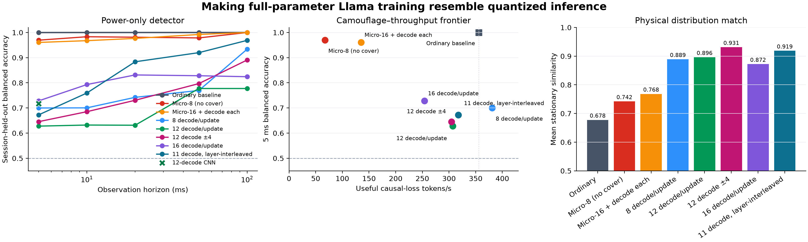

# Continuous whole-model Llama training disguised as inference

This experiment asks whether genuine full-parameter transformer training can be scheduled so that an
external current monitor sees something closer to a continuously serving inference process. It lives
on the isolated Git branch `experiment/llama-continuous-whole-model`; the earlier GPT-OSS experiment
remains frozen on `experiment/gpt-oss-inference-shaped-training`.

The experiment does **not** use model markers, synchronized acquisition, selected layers, synthetic
signals, NVML, or label metadata as classifier input. Every reported physical trace was measured on the
H100 input with the installed current clamp and ChipWhisperer Husky Plus.

## Current result in one paragraph

The ordinary workloads are trivially separable: a session-held-out power-only ridge detector gets
99.98% at 5 ms and 100% at 10–100 ms. Literal `M=1` row chopping is mathematically exact but counter-
productive: 96% of its profiled ATen GEMMs have one input row, yet continuous kernel similarity falls
from 0.411 to 0.342 and useful training throughput falls about 30×. Short-sequence gradient accumulation
works better physically, and interleaving real NF4 cached-decode tokens works better at the kernel level.
The best validated schedule is fused AdamW plus 12 real decode tokens per update. Across four complete
sessions per process (32 traces each), it reaches 0.896 stationary physical similarity and reduces the
ridge detector to 62.77% at 5 ms, 63.20% at 10 ms, and 77.73% at 100 ms. A raw-waveform residual CNN
gets 71.70% at 5 ms in the strongest attempted configuration. Useful training throughput is 307
causal-loss tokens/s—86% of the original 8-bit-Adam baseline. This is a substantial reduction from
near-perfect detection, not a claim of
universal indistinguishability.

## Threat model

The observer receives only contiguous current-probe ADC samples:

```text
x[0], x[1], x[2], ...
```

The observer does not know iteration boundaries and receives no CUDA events, phase annotations, loss,
throughput, prompt, token, batch, cache, NVML, or host timing. The GPU process starts and warms before
the scope is armed. Each 100 ms acquisition begins after an independent random 0–500 ms armed delay.
Complete inference and training sessions—not windows from the same trace—are held out during scoring.

Labels and workload metadata remain in the stored dataset solely to audit what actually ran and score
the experiment.

## Actual workloads

### Inference reference

- `meta-llama/Llama-3.1-8B`, all 32 transformer layers;
- NF4 double-quantized weights with BF16 compute;
- changing 32-token prompt prefills;
- real autoregressive cached decode, changing generated token and KV cache;
- 32 decode tokens per request, then another changing request;
- continuously running in a spawned process before any acquisition is armed.

### Training target

- the same 32-layer architecture;
- all 8,030,261,248 parameters across all 291 parameter tensors are trainable;
- BF16 weights and gradients;
- real causal-LM loss, full forward, reverse-mode backward, optimizer update, and changing token slices;
- either 8-bit AdamW state or full-state fused AdamW;
- every benchmarked schedule reports 291/291 gradient-bearing tensors and 291/291 tensors in the
  optimizer; optimizer state is initialized before capture;
- continuously running in a spawned process before any acquisition is armed.

Training weights are not directly stored in NF4 because that would either freeze them, turn the task
into adapter training, or require higher-precision master weights anyway. Quantizing optimizer state
provides one headroom option. Full-state fused AdamW also fits alongside a separate NF4 serving model:
the validated peak is 65.25 GiB on the 80 GB H100.

## Scheduling mechanisms tested

### 1. Short-sequence gradient accumulation

A 128-token update is split into independent shorter causal sequences, each with a genuine full-model
forward and backward. Gradients accumulate before one optimizer step. This makes the dominant dense
GEMMs shorter and repeats forward/backward motifs at finer temporal granularity. It changes available
context per loss token, so it is a valid training schedule but not numerically identical to a single
128-token causal sequence.

### 2. Exact token-row linear decomposition

Every one of the model's 225 dense linear modules is replaced by custom autograd that evaluates its
forward and input gradient one token row at a time. Forward values, input gradients, weight gradients,
and bias gradients match ordinary `nn.Linear` within numerical tolerance; no gradient is detached or
approximated.

### 3. Exact hybrid weight-gradient decomposition

In addition to token-row forward/input-gradient calls, one column of every weight gradient is computed
using a zero-padded matrix product with the same `M=1, K=in_features, N=out_features` geometry as a
cached-decode projection. Remaining columns use the ordinary exact reduction. This is useful as a
controlled test, but padding and serialization create a strong new signature.

### 4. Real quantized decode interleaving

A second NF4 copy of Llama maintains a genuine autoregressive KV cache. Configured numbers of decode
tokens run between training microbatches. This is cover computation, but it is real serving work rather
than a fake matrix multiply, and its cost is included in useful training throughput.

### 5. Decode interleaving inside backward

Gradient hooks on every third transformer layer insert one real NF4 decode after that layer's gradient
is produced, chopping backward into 11 inference-separated segments. This retains 317 useful loss
tokens/s and raises stationary similarity to 0.919. It nevertheless becomes *more* detectable over long
horizons: accuracy rises from 67.25% at 5 ms to 96.88% at 100 ms. The regular inter-layer cadence is a
learnable temporal signature, demonstrating that marginal waveform similarity is not the objective.

### 6. Randomized cover length

The fixed cover-12 schedule is also tested with a session-seeded uniform draw of 8–16 decode tokens per
update (mean 12). It preserves 305 useful loss tokens/s and raises stationary similarity to 0.931, but
classification worsens to 64.55% at 5 ms and 89.06% at 100 ms. Removing one fixed period is not enough;
the resulting session-level mixture remains learnable.

## What the kernel audit found

The profiler records complete CUDA streams and compares indefinitely repeated processes without
assuming aligned iteration starts. The score combines normalized kernel-family and exact-kernel
duration distributions, cyclic family bigrams/trigrams, launch gaps, and duration distributions.

| Training schedule | Kernel similarity | ATen GEMMs with `M=1` |
|---|---:|---:|
| Ordinary 8-bit AdamW, sequence 128 | 0.411 | 0.0% |
| Fused AdamW, sequence 128 | 0.442 | 0.0% |
| Fused AdamW + 1 decode/update | 0.576 | 0.2% |
| Fused AdamW + 4 decodes/update | 0.721 | 0.9% |
| Fused AdamW + 12 decodes/update | **0.843** | 2.6% |
| Sequence 8 × accumulation 16 | 0.518 | 0.0% |
| Exact token-row decomposition | 0.342 | **96.0%** |
| Exact hybrid `dW` decomposition | 0.409 | 87.5% |
| 11 decodes interleaved through backward | 0.834 | 2.4% |

One cached NF4 token contains 224 `gemm_4bit_simt` launches. In the original training baseline, the
8-bit AdamW update contributes about 290 ms of blockwise optimizer kernels while all dense training
GEMMs contribute about 31 ms. This is why changing GEMM geometry alone cannot erase the training
signature: it initially optimizes the minority of the temporal process. In the measured cover-12
update, real quantized GEMMs account for 28.9% of profiled CUDA busy time.

The exact row experiment is the strongest negative result. Maximizing a local proxy (`M=1` calls)
created thousands of serialized BF16 launches and memory operations, reducing the actual continuous
match. Conversely, layer-interleaved cover nearly matches the best kernel process (0.834 versus 0.843)
and reaches 0.919 stationary physical similarity, but remains 96.88% detectable at 100 ms because its
cadence is regular. No single
distributional proxy replaces a held-out temporal detector; the physical capture remains the objective.

Compact evidence is in
[`kernel_audit_summary.json`](../../results/llama_continuous_whole_model/kernel_audit_summary.json).
Raw profiler streams remain in the dated H100 experiment directory rather than bloating Git history.

## Throughput frontier

“Useful loss tokens” counts causal targets, not input tokens, cover tokens, or redundant operations.
All values are measured after one warmup update on the same H100.

| Schedule | Useful loss tokens/s | Relative to original |
|---|---:|---:|
| Original sequence-128 8-bit AdamW | 356 | 1.00× |
| Sequence-128 fused AdamW | 940 | 2.64× |
| Fused AdamW + 1 decode/update | 686 | 1.93× |
| Fused AdamW + 8 decodes/update | 381 | 1.07× |
| Fused AdamW + 12 decodes/update | 307 | 0.86× |
| Fused AdamW + 12 ± 4 decodes/update | 305 | 0.86× |
| Fused AdamW + 16 decodes/update | 254 | 0.71× |
| Fused sequence 32 × accumulation 4 | 341 | 0.96× |
| Fused sequence 16 × accumulation 8 | 180 | 0.51× |
| Fused sequence 16 × accumulation 8 + 1 decode each | 135 | 0.38× |
| 8-bit AdamW sequence 8 × accumulation 16 | 67 | 0.19× |
| Exact token-row sequence 8 | 12 | 0.03× |
| Exact hybrid sequence 2 | 2 | 0.006× |

Fused AdamW uses the same AdamW update rule and hyperparameters as the baseline but avoids the slow
per-tensor 8-bit optimizer implementation. It is both a control and a practical source of budget for
cover work.

## Physical screening results

All 106 screening captures below passed SideCapture's trace-health checks. Each candidate has six
training traces and shares two independently captured inference sessions (16 reference traces).

| Schedule | Mean stationary similarity | Raw amplitude | Normalized amplitude | Welch PSD |
|---|---:|---:|---:|---:|
| Ordinary fused AdamW | 0.684 | 0.618 | 0.793 | 0.642 |
| Exact token-row | 0.706 | 0.619 | 0.809 | 0.691 |
| Exact hybrid | 0.686 | 0.583 | 0.810 | 0.666 |
| Sequence 8 × accumulation 16, 8-bit AdamW | 0.826 | 0.901 | 0.836 | **0.742** |
| Fused AdamW + 8 decodes/update | 0.815 | 0.927 | 0.884 | 0.634 |
| Fused AdamW + 12 decodes/update | **0.852** | **0.950** | **0.924** | 0.682 |
| Fused sequence 16 × accumulation 8 + 1 decode each | 0.850 | 0.907 | 0.886 | **0.758** |

Similarity is `1 - Jensen–Shannon divergence`, averaged over raw amplitude, per-trace standardized
amplitude, and Welch spectral distributions. It is useful for search but does not prove that a trained
classifier fails. The strict multi-session detector result below supersedes this screening table.

## Strict multi-session result

Each row below uses four independently initialized inference sessions and four independently initialized
training sessions, eight healthy 100 ms traces per session. Every fold leaves one complete inference
session and one complete training session out. The attacker receives ADC windows only.

| Schedule | Stationary similarity | 5 ms | 10 ms | 20 ms | 50 ms | 100 ms | Useful targets/s |
|---|---:|---:|---:|---:|---:|---:|---:|
| Ordinary training | 0.678 | 99.98% | 100.00% | 100.00% | 100.00% | 100.00% | 356 |
| Sequence 8 × accumulation 16, no cover | 0.742 | 96.95% | 98.32% | 98.13% | 97.85% | 100.00% | 67 |
| Sequence 16 × accumulation 8 + decode each | 0.768 | 96.05% | 96.76% | 97.66% | 99.22% | 100.00% | 135 |
| Fused AdamW + 8 decodes/update | 0.889 | 69.98% | 70.04% | 74.22% | 76.95% | 93.36% | **381** |
| **Fused AdamW + 12 decodes/update** | **0.896** | **62.77%** | **63.20%** | **63.13%** | **77.73%** | **77.73%** | 307 |
| Fused AdamW + 12 ± 4 decodes/update | **0.931** | 64.55% | 68.52% | 73.05% | 79.69% | 89.06% | 305 |
| Fused AdamW + 16 decodes/update | 0.872 | 72.81% | 79.30% | 83.13% | 82.81% | 82.42% | 254 |
| 11 decodes interleaved through backward | **0.919** | 67.25% | 75.94% | 88.36% | 91.99% | 96.88% | 317 |

The cover-12 ridge result has substantial session variation at 5 ms: 62.77% mean balanced accuracy,
15.00 percentage-point fold standard deviation, and a 24.69–75.31% fold range. A separately trained
raw-waveform 1D residual CNN reaches 71.70% in the stronger of two reported 5 ms configurations
(10.97-point fold standard deviation, 53.44–92.81% range); a 20 ms CNN reaches 67.42%. The two
independently structured attackers agree that the short-window signal is much harder than the ordinary
baseline, while the fold and configuration spread warn against treating the mean as a universal guarantee.



Compact metrics are in
[`final_summary.json`](../../results/llama_continuous_whole_model/final_summary.json), and the best
four-session waveform/spectrum overview is in
[`final_eval/fused-cover12/continuous_power_overview.png`](../../results/llama_continuous_whole_model/final_eval/fused-cover12/continuous_power_overview.png).
Exact software, model, GPU, sensor-chain, and resolved acquisition metadata are in
[`provenance.json`](../../results/llama_continuous_whole_model/provenance.json).

## Reproduce

The commands assume SideCapture and the validated ChipWhisperer fork are on `PYTHONPATH` and that the
Llama checkpoint is cached locally.

Benchmark one full-parameter schedule without opening the scope:

```bash
python benchmark_schedule.py \
  --sequence-length 128 \
  --gradient-accumulation-steps 1 \
  --optimizer adamw_fused \
  --cover-decode-tokens-per-microbatch 12 \
  --bitsandbytes-path /path/to/bitsandbytes
```

Capture an arbitrary continuous window:

```bash
python capture_continuous.py \
  --mode training \
  --session-id training-00 \
  --output-dir runs/llama-continuous \
  --captures 8 \
  --duration 100ms \
  --sample-rate 1.5MHz \
  --training-sequence-length 128 \
  --gradient-accumulation-steps 1 \
  --optimizer adamw_fused \
  --cover-decode-tokens-per-microbatch 12 \
  --bitsandbytes-path /path/to/bitsandbytes
```

Analyze complete held-out sessions:

```bash
python analyze_continuous.py --root runs/llama-continuous
```

Profile a complete training update:

```bash
python profile_kernel_schedule.py \
  --mode training \
  --optimizer adamw_fused \
  --sequence-length 128 \
  --cover-decode-tokens-per-microbatch 12 \
  --output runs/kernel-profile.json
```

## Files

| File | Purpose |
|---|---|
| `continuous_workloads.py` | Persistent whole-model inference/training workers and real decode cover |
| `training_shapes.py` | Exact token-row and hybrid linear autograd |
| `capture_continuous.py` | Unaligned SideCapture acquisition with random armed delay and retry/recovery |
| `benchmark_schedule.py` | Full-model gradient/state/memory/throughput verification without scope use |
| `profile_kernel_schedule.py` | Complete CUDA kernel and ATen GEMM geometry profiler |
| `analyze_kernel_profiles.py` | Boundary-free compact kernel-process comparison |
| `kernel_similarity.py` | Self-contained cyclic kernel-family/duration similarity metric |
| `analyze_continuous.py` | Stationary metrics and strict session-held-out power-only detector |
| `power_features.py` | Self-contained amplitude, RMS, spectral, and window features |
| `cnn_detector.py` | Raw-waveform residual CNN with complete-session holdout |
| `render_final_results.py` | Compact result manifest and detector/throughput figure |

## Measurement limitations

- Acquisition is 1.5 MSPS for these 100 ms comparisons. The installed TA189 clamp is specified flat
  only to 100 kHz; behavior above that is not calibrated.
- Similarity is specific to this H100, probe placement, analog chain, gain, sample rate, model, and
  software stack.
- The short repeated corpus is intended to stabilize controlled systems measurements, not establish
  language-model quality.
- Cover schedules intentionally trade useful training throughput and serving work. Both are reported;
  cover-dominated windows are not relabeled as useful training.
- A low detector score against one feature model is not universal indistinguishability. Longer
  observations, other sensors, and stronger sequence models remain relevant attacks.
