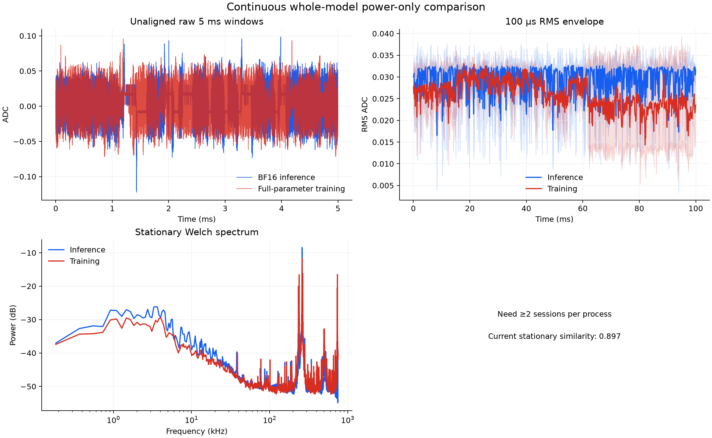

# Cyclic SCS carrier — measured rejection

## Question

Can inference and full-parameter training be made power-indistinguishable by
embedding their GEMMs in one shortest common supersequence (SCS)?

## Construction

Let inference and training expose ordered GEMM streams `I` and `T`. The code
builds a weighted SCS `S` and executes every slot in both roles:

- a real slot uses the workload's semantic operands and consumes its output;
- a missing slot uses scratch operands and discards its output.

A signature includes the Triton binary, launch geometry, shared memory, logical
shape, strides, and operand class. The executor fails closed if either real
workload stops being an exact subsequence of the manifest.

The measured 3-inference / 2-training superperiod contains:

| Quantity | Value |
|---|---:|
| Common identical-Triton GEMM slots | 2,599 |
| Real inference GEMMs | 1,695 |
| Real training GEMMs | 1,356 |
| Shared real/real slots | 452 |
| Inference padding GEMMs | 904 |
| Training padding GEMMs | 1,243 |

H100 profiling confirmed that both roles launched the same 2,599 GEMM
signatures in the same order. Their ordered-signature hashes were identical,
and the median absolute per-launch duration difference in the initial
geometry-only profile was 11.0 microseconds.

## Operand-value correction

Identical GEMM instructions are not sufficient: BF16 values alter transistor
switching, power throttling, and therefore both power and runtime. The second
version snapshots real operands while each call is live, records raw BF16 bit
reservoirs plus sign/exponent/Hamming statistics, and uses the opposite
workload's measured values for padding. This also fixed a previous measurement
bug where reused buffers were sampled after the call.

All 40 compressed reservoirs validated by checksum on the H100. On a physical
4-by-4 scope screen at 1.5 MSPS for 100 ms, PSD similarity rose from 0.655 to
0.743 and mean stationary similarity rose from 0.877 to 0.897.

## Why this is rejected

The raw windows and envelopes remain visibly different. More decisively, the
same nominal 2,599-GEMM schedule takes **3.30 s in inference and 4.35 s in
training**. That 32% period gap contradicts computational identity.

There are two root causes:

1. **Only GEMMs are coordinated.** One base inference period contains 2,772
   non-GEMM CUDA kernels; one base training period contains 1,920. Attention,
   normalization, elementwise, reduction, loss, backward, and optimizer kernels
   remain interleaved differently around the common GEMM stream.
2. **Marginal values are not a temporal operand process.** Reservoirs are
   aggregated by physical signature and tiled into scratch tensors. Repetition
   makes padding more predictable than real per-slot activations and gradients.
   The 452 shared real/real slots also retain different operands.

Stationary PSD overlap was therefore a misleading screening improvement, not a
security result. No grouped-classifier success claim is made for this branch.

## Consequence

The next experiment removes the role flag from GPU execution entirely. Both
roles must run one identical fused forward/backward/update program on identical
state and data; only the host-side consumer may decide whether logits or updated
weights are useful. Anything weaker leaves an observable computational branch.
