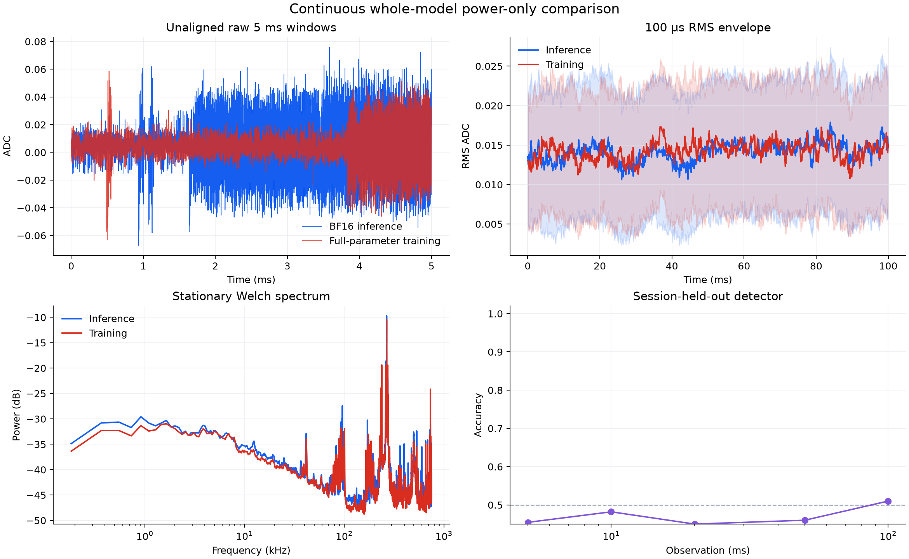

# Identical dual-role Llama workload

This experiment enforces the requirement that the observed GPU computation is
entirely identical while its host-side meaning differs.

## One fused model step

Each iteration concatenates inference and training examples into one batch and
executes:

1. one Llama forward over the combined batch;
2. an inference-token reduction over the inference rows;
3. cross-entropy over only the training rows;
4. one full backward pass;
5. one exact SGD update.

The inference rows have zero loss gradient, so the update is a valid gradient
step for the training examples. Their logits are still ordinary inference
outputs from the same forward pass.

Inputs come from a deterministic 64-minibatch ring. Both roles traverse the
same ring, but the model cannot overfit one fixed random batch within seconds
and create capture-time-dependent switching activity.

Both roles run all five stages with identical checkpoint state, inputs, targets,
RNG seed, operands, memory accesses, and updates. The role flag is absent from
the GPU engine. Only after synchronization does the host select an artifact:

- **inference:** expose the already-computed logits and discard the updated
  state after the run;
- **training:** retain the already-computed updated state and discard the
  logits.

This semantic selection cannot change the measured GPU trace.

## Why this follows from the LCS experiment

The failed SCS carrier aligned a post-hoc GEMM subsequence. It left non-GEMM
kernels, operand values, and future state different. Here the common subgraph is
shared before scheduling: the model forward is computed once, and every
non-common operation is executed by both roles. There is no runtime padding or
role-dependent GPU branch.

## Required evidence

The branch is not successful merely because the source looks symmetric. It must
show all of the following on the H100:

1. matching computation fingerprints;
2. identical full CUDA event-signature sequences;
3. identical losses, inference checksums, parameter checksums, and update counts;
4. non-zero parameter change and finite training loss;
5. healthy physical scope traces;
6. fresh session-held-out classifier balanced accuracy below 60% at every
   5/10/20/50/100 ms horizon.

Only after that gate is met should batch sizing, CUDA graphs, compilation, or
custom kernels be used to maximize useful training FLOPs/s.

## Measured H100 result

The gate-passing configuration uses 1,024 inference rows, 2,048 training rows,
sequence length 1, and a 64-minibatch ring.

### Exact execution proof

| Check | Result |
|---|---:|
| Computation fingerprint equal | yes |
| Ready loss/checksums/update counts bit-identical | yes |
| CUDA events per role | 2,382 |
| Ordered CUDA-signature hash equal | yes |
| Event-duration correlation | 0.999981 |
| Median absolute event-duration difference | 0.129 microseconds |
| Dense parameter change after three updates | 1.049e-5 |

### Physical power-only attacker

Five independent sessions per role produced 30 inference and 30 training
traces. Every health check passed. Splits leave one complete session from each
role out; the attacker sees ADC samples only.

| Observation | Balanced accuracy | Classifier error |
|---|---:|---:|
| 5 ms | 45.45% | 54.55% |
| 10 ms | 48.20% | 51.80% |
| 20 ms | 45.00% | 55.00% |
| 50 ms | 46.00% | 54.00% |
| 100 ms | 51.00% | 49.00% |

All required horizons are below the 60% balanced-accuracy gate.

Stationary similarity is 0.9997 for raw amplitude, 0.9992 after per-trace
normalization, and 0.9626 for Welch PSD.

### Initial throughput

The uncompiled BF16 baseline sustains approximately 72.9 TFLOP/s of executed
model work and 48.6 TFLOP/s of useful training work under the parameter-count
FLOP model. With 2,048 of 3,072 rows assigned to training, current training-side
compute overhead is one third. These are optimization baselines, not hardware
performance-counter measurements.
