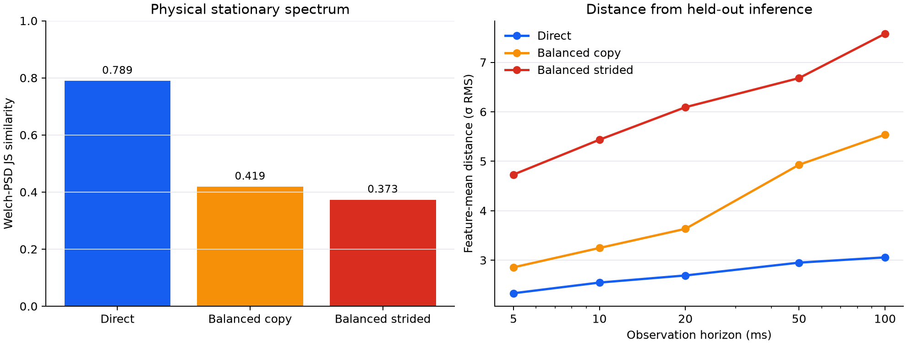

# Shared-shape cuBLAS training carrier

**Status: physically rejected.** This experiment made every useful linear forward, `dX`, and `dW`
pass through an audited `torch.mm`/cuBLAS carrier. It preserved real full-model training and high
throughput, but it did **not** make forward and backward use one proven kernel binary. Physical H100
captures show that matching nominal GEMM dimensions and aggregate counts is insufficient.



## What was tested

- `unsloth/Llama-3.2-1B-Instruct`, BF16, all 1.235B parameters trainable;
- 2,048 flattened training rows split into 1,024-row GEMMs;
- one model, no inference cover, no filler kernels, and no unreported redundant GEMMs;
- exact next-token cross-entropy and SGD updates;
- direct dW tiling, deferred dW scheduling, inference-balanced dW orientation, and a no-copy
  transposed-stride parameter layout;
- 1.5 MSPS, 100 ms, 150,000-sample ChipWhisperer Husky Plus captures.

## Mathematical result

For each logical linear weight `W`, the carrier computes the real operations

```text
forward: Y  = X @ W.T
dX:      dX = dY @ W
dW:      dW = dY.T @ X
```

The strongest numerical validation checked all 1,235,814,400 parameter values:

| Check | Result |
|---|---:|
| Loss absolute difference | 0 |
| Gradient relative L2 difference | 0.001463 |
| Updated-parameter relative L2 difference | 2.99e-7 |
| Useful linear FLOPs/update | 15.185 TFLOP |
| Redundant carrier FLOPs | 0 |

The balanced carrier produced 226 forward, 226 dX, and 226 dW launches: 678 total, equal to six
times the 113 linear launches in one batch-1,024 inference pass. This was only a shape/count identity,
not a machine-kernel identity.

## Physical result

The table is a single-session screening diagnostic against five independent inference sessions. It is
not the final grouped detector gate; candidates this far away were rejected before costly collection.

| Candidate | PSD JS similarity | Feature distance, 5 ms | Feature distance, 100 ms |
|---|---:|---:|---:|
| Best direct carrier | **0.789** | **2.33σ** | **3.06σ** |
| Balanced dW with transpose copy | 0.419 | 2.85σ | 5.54σ |
| Balanced no-copy strided dW | 0.373 | 4.73σ | 7.58σ |

The no-copy balanced carrier retained 17.20k useful targets/s versus 17.01k for ordinary training, but
its physical trace was the least inference-like. Throughput therefore was not the blocker.

## Why it failed

Calling the same high-level operator with similar M/N/K dimensions does not guarantee the same GPU
execution. Forward and backward still differed in transpose flags, strides, operand roles, memory
traffic, epilogues, launch order, and likely cuBLAS algorithm/kernel selection. Nonlinear backward and
optimizer kernels also have no inference counterpart.

The next experiment must use one compiled microkernel binary and fixed launch geometry for inference,
forward, dX, and dW, and verify that identity with profiler/kernel metadata before physical capture.

## Reproduction entry points

```bash
# Full-model numerical validation
python -m experiments.llama_shared_kernel_training_carrier.validate_carrier \
  --training-batch-size 2048 --sequence-length 1 --row-tile 1024 \
  --weight-gradient-layout inference-balanced-strided \
  --weight-gradient-schedule streaming-inference-cycle \
  --streaming-dw-tasks-per-record 3 \
  --output validation.json

# Physical capture
python -m experiments.llama_strict_inference_shaped_training.capture_strict \
  --mode shaped-training --session-id carrier-strided --output-dir captures \
  --captures 8 --duration 100ms --sample-rate 1.5MHz --gain-db 10 \
  --training-batch-size 2048 --sequence-length 1 --tile-rows 1024 \
  --shaping-backend shared-carrier \
  --shared-carrier-dw-layout inference-balanced-strided \
  --weight-gradient-schedule streaming-inference-cycle \
  --streaming-dw-tasks-per-record 3
```

Machine-readable evidence is in
[`results/llama_shared_kernel_training_carrier`](../../results/llama_shared_kernel_training_carrier).
