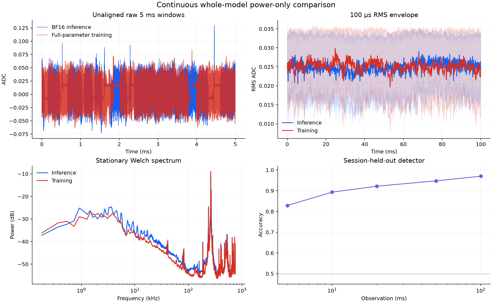

# Result: one shared GEMM binary is insufficient

The custom inference and exact-training paths use the same audited Triton GEMM
binary, and the training update is mathematically exact. This substantially
improves stationary trace similarity, but it does not fool a session-held-out
attacker because the full event sequences and cadence still differ.

## Decision

**Classifier gate failed.** Required balanced accuracy is below 60% at every
window horizon; measured accuracy ranges from 82.9% to 97.0%.

| Horizon | Balanced accuracy | Classifier error |
|---:|---:|---:|
| 5 ms | 82.89% | 17.11% |
| 10 ms | 89.33% | 10.68% |
| 20 ms | 92.20% | 7.80% |
| 50 ms | 94.75% | 5.25% |
| 100 ms | 97.00% | 3.00% |

The attacker receives ADC power samples only. Each fold leaves one complete
inference session and one complete training session out, so windows from a held
out session never leak into training.

## Positive findings

- Exact full-model training: zero loss, gradient, and update difference over
  1,235,814,400 parameter values.
- One compiled GEMM binary was observed in each mode, with matching Triton and
  cubin hashes.
- Raw-amplitude, normalized-amplitude, and Welch-PSD similarities were 0.9979,
  0.9971, and 0.9195; their mean was 0.9715.

## Interpretation

Kernel-binary identity matches only one layer of abstraction. Residual detector
features are dominated by autocorrelation, extrema/envelope behavior, and
spectral bands, consistent with different ordered launch sequences and cadence.
The follow-up uses cyclic weighted LCS/SCS alignment to construct one shared
temporal block schedule.

Machine-readable values and hashes are in [`summary.json`](summary.json).
